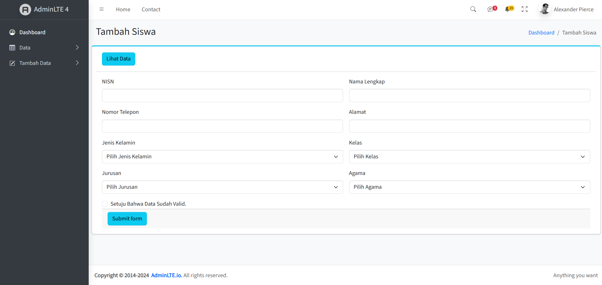
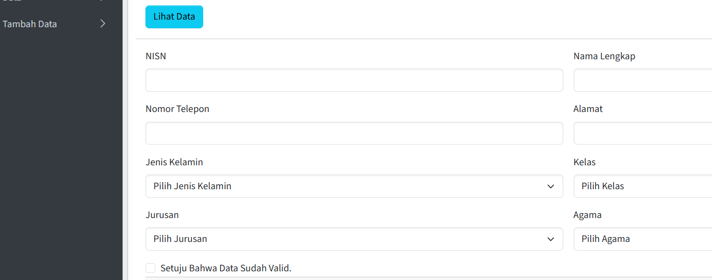
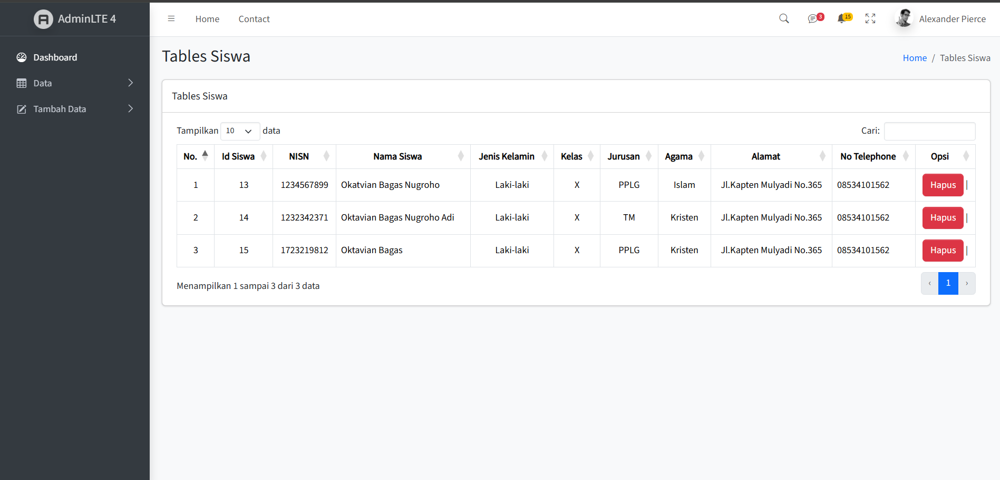
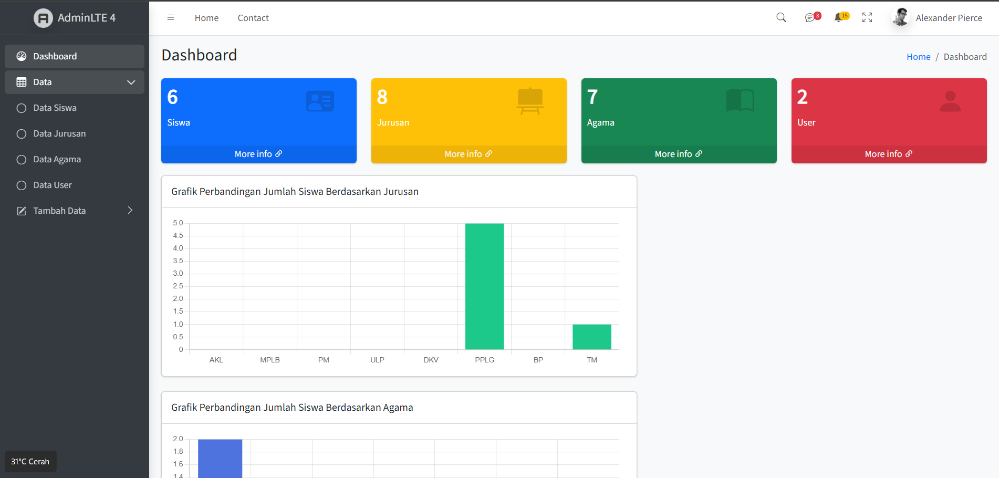

# 📊 Dashboard Manajemen Data Sekolah

Website ini adalah aplikasi **Dashboard Admin** berbasis web yang dikembangkan dengan **AdminLTE 4**, digunakan untuk menampilkan dan mengelola data siswa, jurusan, agama, dan user secara dinamis. Terdapat grafik interaktif serta menu navigasi modern yang responsif.

---

## 🎯 Fitur Utama

- ✅ **Dashboard Ringkasan**

  - Jumlah total siswa, jurusan, agama, dan user
  - Info visual dengan card berwarna dan ikon

- 📈 **Grafik Statistik**

  - Grafik jumlah siswa berdasarkan **jurusan**
  - Grafik jumlah siswa berdasarkan **agama**
  - Dibuat menggunakan Chart.js

- 📁 **Manajemen Data**

  - Data Siswa
  - Data Jurusan
  - Data Agama
  - Data User
  - Fitur Tambah Data

- 🎨 **UI Modern**
  - Menggunakan AdminLTE 4
  - Sidebar interaktif
  - Mode responsif (mobile-ready)

---

## 🧱 Teknologi yang Digunakan

- HTML5, CSS3, JavaScript
- [AdminLTE 4](https://adminlte.io)
- Bootstrap 5
- FontAwesome Icons
- Chart.js untuk grafik

---

## 📸 Cuplikan

login

dashboard

lihat data

tambah data

---

## 📂 Struktur Navigasi

- **Dashboard** – Halaman utama yang menampilkan ringkasan data dan grafik
- **Data**
  - Data Siswa
  - Data Jurusan
  - Data Agama
  - Data User
- **Tambah Data** – Form untuk menambahkan entri baru
  - Tambah Data Siswa
  - Tambah Data Jurusan
  - Tambah Data Agama
  - Tambah Data User
- **Navigasi Atas**
  - Home
  - Contact
  - Profil dan notifikasi pengguna

---
